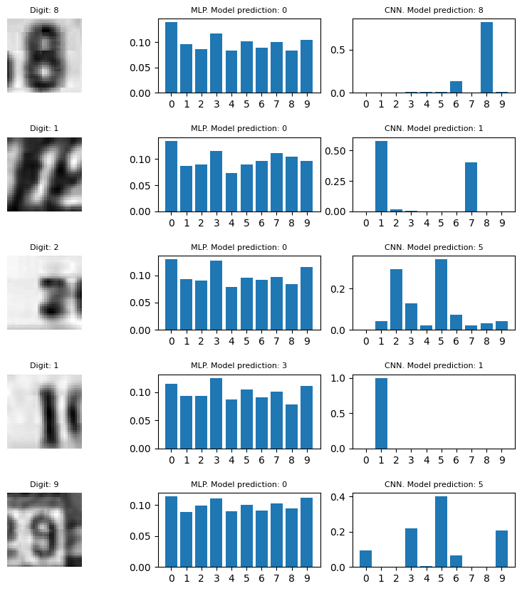

# 🖼️ SVHN Digit Classification: Deep Learning Comparative Study
### *Neural Networks & Computer Vision Research*


---

## 📋 Project Overview
This repository contains an end‑to‑end deep learning project for classifying digits from the **Street View House Numbers (SVHN)** dataset.  
Two models are implemented and compared:
- A **Multilayer Perceptron (MLP)**
- A **Convolutional Neural Network (CNN)**

The CNN achieves higher accuracy with **7× fewer parameters**, demonstrating the efficiency of convolutional architectures for image‑based tasks.

---

## 🎯 Research Objective
Conducted within the framework of the Imperial College London TensorFlow 2 Professional Certification, this study addresses the complexities of real‑world digit recognition using the Street View House Numbers (SVHN) dataset.

Unlike the standardized MNIST dataset, SVHN presents a high-dimensional challenge involving natural scene backgrounds, varying lighting, and overlapping digits. The primary objective was to execute a comparative analysis between Multilayer Perceptrons (MLP) and Convolutional Neural Networks (CNN) to evaluate:

Spatial Hierarchy Extraction: Investigating the CNN’s ability to preserve local connectivity and detect edges/shapes versus the MLP's flat feature processing.

Architectural Efficiency: Quantifying the trade-offs between parameter count and classification performance—resulting in a CNN champion model with 7× fewer parameters than the baseline MLP.

Robust Optimization: Implementing an end‑to‑end TensorFlow 2 workflow utilizing custom Callbacks (EarlyStopping, ModelCheckpoint), BatchNormalization, and Stochastic Regularization (Dropout) to achieve high generalization on unseen natural imagery.

---

## 📊 Methodology (Research Pipeline)
The project was executed through a rigorous deep learning pipeline designed to evaluate model performance under real-world image noise and spatial variance.
1. Data Engineering & Preprocessing
    - **Dataset Acquisition**: Leveraged the Scipy library (`scipy.io.loadmat`) to ingest Format 2 (32x32 cropped) images from the Stanford SVHN repository.
    - **Dimensionality Reduction**: Converted RGB imagery to grayscale to reduce computational complexity while retaining essential structural features for digit recognition.
    - **Feature Scaling**: Normalized pixel intensities to the range $[0, 1]$ to ensure stable gradient descent and faster convergence during training.
2. Architectural Design (Comparative Modeling)
Two distinct architectures were developed using the TensorFlow 2 Sequential API to benchmark spatial awareness:
    - **MLP Baseline:** A 4-layer deep feed-forward network. While high-capacity, it lacked the inductive bias required to process 2D spatial relationships efficiently.
    - **CNN Champion:** A convolutional architecture utilizing Conv2D layers for local feature extraction and MaxPooling2D for translation invariance. This model achieved superior results with 7× fewer parameters than the MLP.
3. Optimization & Model Governance
To ensure the model met professional deployment standards, advanced training strategies were implemented:
    - **Stochastic Regularization:** Applied Dropout ($p=0.3$) and BatchNormalization to mitigate internal covariate shift and prevent overfitting on the noisy SVHN backgrounds.
    - **Dynamic Learning:** Utilized the Adam optimizer with `SparseCategoricalCrossentropy` to minimize the objective function.
    - **Automated Callbacks:** Implemented a robust monitoring system using:
        - `EarlyStopping`: To halt training at the point of diminishing validation returns.
        - `ModelCheckpoint`: To persist only the weights corresponding to the global minimum of the validation loss.

---

## 📈 Results & Evaluation
The study confirms that the CNN architecture is substantially more robust for image-based tasks due to its ability to preserve local connectivity.

| Architecture | Test Accuracy | Observations |
| :--- | :--- | :--- |
| **MLP (Baseline)** | ~88% | High parameter count; susceptible to noise.  |
| **CNN (Champion)** | **~92%*** | Efficient parameter usage; high real-world robustness. |



### **Strategic Analysis: Loss & Accuracy**
The CNN demonstrated stable convergence. The use of regularization layers ensured the validation loss remained low, indicating a model that generalizes well to new, unseen digits.


---

## 💡 Key Insights
* **Spatial Hierarchy:** Unlike MLPs, which treat pixels as independent features, CNNs successfully identified "edges" and "shapes," which are crucial for digit recognition.
* **Regularization:** Without Dropout layers, both models exhibited rapid overfitting, highlighting the importance of stochastic regularization in deep networks.
* **Parameter Efficiency:** The CNN achieved superior results with fewer weights than the deep MLP.

---

## 📂 Project Deliverables
- **[Jupyter Notebook](./notebooks/svhn_image_classifier.ipynb):** Full end-to-end TensorFlow implementation, including data pipeline and model training.

---

## ⚙️ Installation & Setup

### **Option A: Cloud Execution (Recommended)**
The most efficient way to reproduce this study is via **Google Colab**. This environment provides the necessary GPU acceleration required for deep learning without the need for local configuration.

[](https://colab.research.google.com/github/fvalerii/svhn-image-classification/blob/main/notebooks/svhn_image_classifier.ipynb)

* **Note:** You will need to upload the SVHN `.mat` files to your Colab session storage or mount your Google Drive to access the dataset.

---

### **Option B: Local Execution (VS Code / Jupyter)**
If you prefer to run the research study locally, ensure you have a Python 3.10+ environment (ideally with GPU support via NVIDIA CUDA).

#### **1. Clone the Repository**
```bash
git clone https://github.com/fvalerii/svhn-image-classification.git
```
### **2. Environment Setup** 
It is recommended to use a environment with Python 3.12.8 and GPU support:
##### Using Pip:
```bash
pip install -r requirements.txt
```
##### Using Conda:
```bash
conda env create -f environment.yml
conda activate svhn_research
```
### **3. Data Acquisition** 
The SVHN dataset (Format 2: Cropped Digits) must be downloaded manually due to its size:
1. Download `train_32x32.mat` and `test_32x32.mat` from [http://ufldl.stanford.edu/housenumbers/]("http://ufldl.stanford.edu/housenumbers/")
2. Place both files inside the `/data/` directory of this project.

### **4. Run the Notebook**
Open the Jupyter Notebook located at notebooks/svhn_image_classifier.ipynb using VS Code or JupyterLab.

---

## 💻 Tech Stack
- **Frameworks:** TensorFlow 2.x, Keras
- **Libraries:** NumPy, Scipy, Matplotlib, Pandas
- **Architecture:** Convolutional-Neural-Networks (CNN), Multi-Layer Perceptrons (MLP)

---

## 🎓 Certification & Academic Context
This project was developed as a **Capstone Research Study** for the **"TensorFlow 2 for Deep Learning" Professional Certification** by **Imperial College London** (via Coursera).

* **Objective:** Demonstrate mastery of the TensorFlow 2 ecosystem, including custom training loops, architecture comparative analysis, and model deployment readiness.
* **Status:** Verified and Peer-Reviewed.
